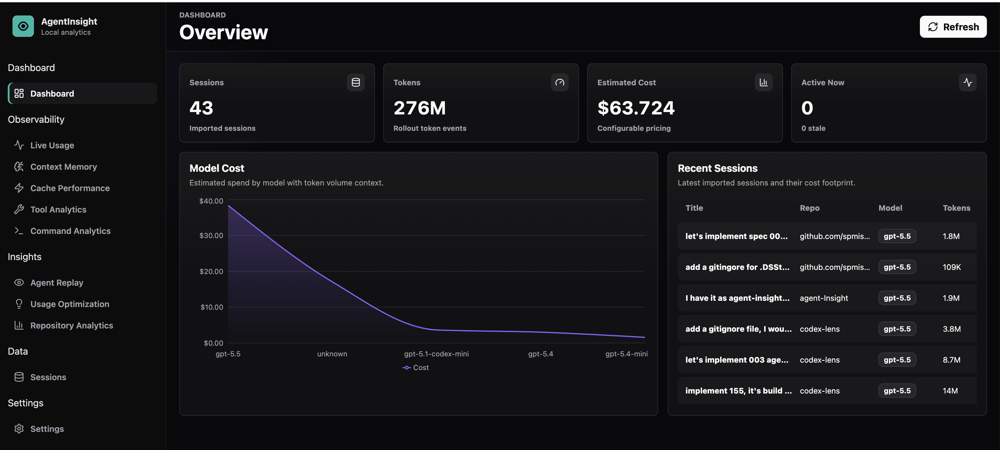
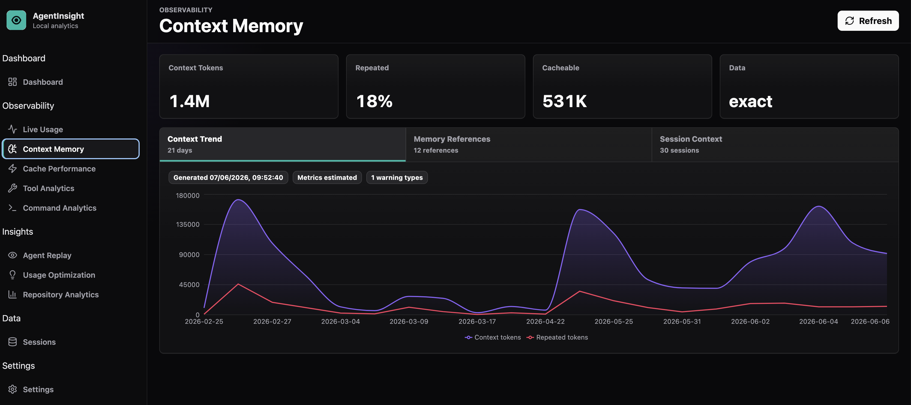
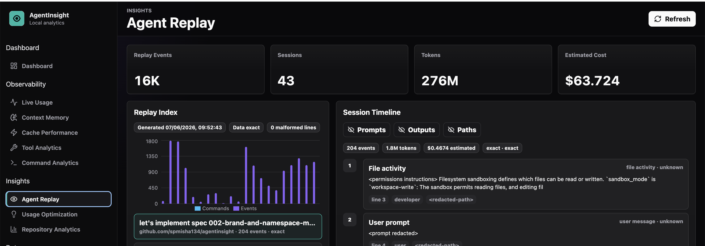
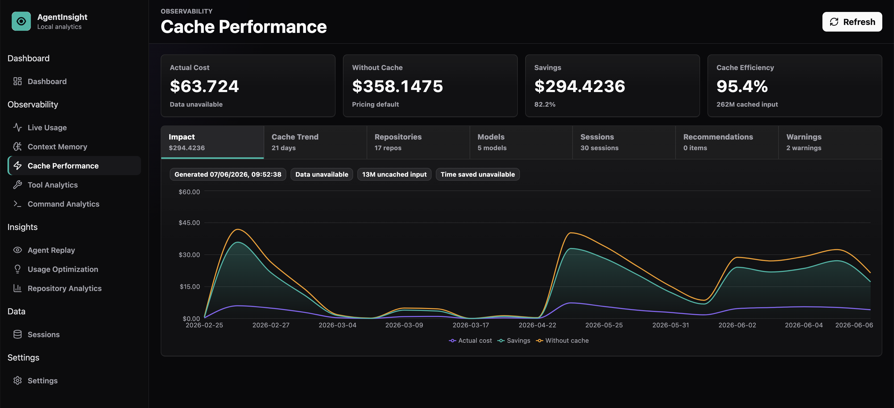
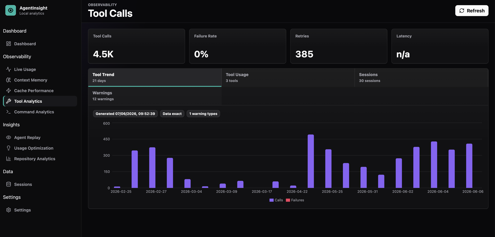
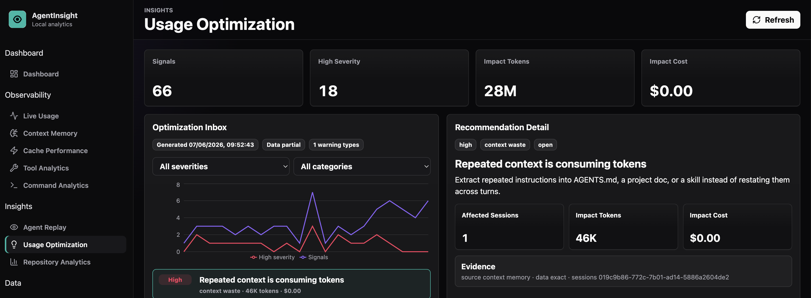
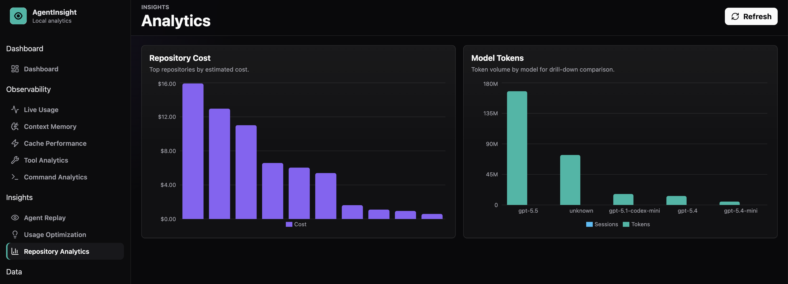
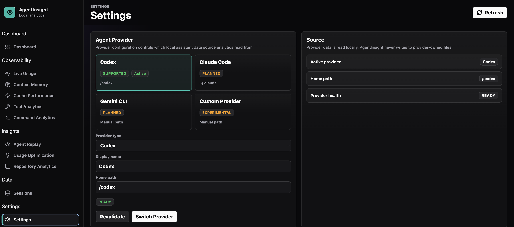

# AgentInsight

Production-ready local observability and analytics for AI coding assistants.



## Preview

<p align="center">
  
  
</p>
<p align="center">
  
  
</p>
<p align="center">
  
  
</p>
<p align="center">
  
</p>

It reads local provider data from paths configured in `.env`. For the Codex provider, configure `AGENTINSIGHT_CODEX_HOME` to a local Codex home directory containing:

- `state_*.sqlite` for thread/session metadata
- `sessions/**/*.jsonl` for events, token usage, tool calls, and transcript data

## Stack

- Backend: Spring Boot 4, Java 21 bytecode, Java 25 runtime, SQLite JDBC
- Frontend: React, TypeScript, Vite, Recharts
- Runtime DB: local SQLite index configured through `.env`
- Deployment: direct dev mode; compose/deployment notes live in the resource folder

## Local Development

```bash
cd agentinsight-api
set -a
. ../.env
set +a
./gradlew bootRun
```

In another terminal:

```bash
cd agentinsight-ui
npm install
npm run dev
```

Backend health:

```text
http://localhost:8081/api/health
```

Open:

```text
http://localhost:5173
```

## Workspace

This repository is structured as a monorepo with separate backend and frontend packages:

```text
agentinsight-api/  Spring Boot API
agentinsight-ui/   React/Vite UI
```

Project specifications, architecture notes, and implementation documents are kept outside this publishable source tree:

```text
../application-build-resources/AgentInsight/
  specs/         source-of-truth specifications
  docs/          project documentation
  template/      UI component and template reference
  ui structure/  React application structure reference
```

Backend commands:

```bash
cd agentinsight-api
./gradlew test
```

Frontend commands:

```bash
cd agentinsight-ui
npm run build
npm run preview
```

## Local Environment

Runtime paths and ports live in the root `.env` file. The file is ignored by Git and must not be committed.

Expected variables:

```text
AGENTINSIGHT_CODEX_HOME=/path/to/.codex
AGENTINSIGHT_DATA_PATH=/path/to/.agentinsight
AGENTINSIGHT_DB_PATH=/path/to/.agentinsight/agentinsight.db
AGENTINSIGHT_API_PORT=8081
AGENTINSIGHT_UI_PORT=5173
SERVER_PORT=8081
```

Direct backend dev mode uses the Gradle wrapper. Gradle 9.5.1 is required because the project runs with Java 25:

```bash
cd agentinsight-api
set -a
. ../.env
set +a
./gradlew bootRun
```

## Features

- **Dashboard Overview**: High-level metrics for sessions, costs, and token usage.
- **Session Explorer & Replay**: Navigate through history with full rollout transcript replays.
- **Live Usage Tracking**: Real-time monitoring of active agent sessions and events.
- **Cost Estimation**: Accurate cost tracking derived from local token events.
- **Token Optimization**: Analytics for cached token savings and context efficiency.
- **Analytics Suites**:
    - **Command Analytics**: Insight into the most frequent and impactful agent commands.
    - **Tool Analytics**: Performance and usage patterns of integrated agent tools.
    - **Context Memory**: Analysis of how much context is being used and retained.
    - **Model & Repository Analytics**: breakdown of usage by specific models and projects.
- **JSONL Rollout Parser**: High-performance streaming parser for local provider logs.
- **Local-Only Design**: Privacy-first architecture that processes data entirely on your machine.

## Cost Accuracy

Cost is estimated from local token events. Prices are configurable in `agentinsight-api/src/main/resources/pricing.yml`.

The first implementation uses the latest `token_count` event per rollout as the final session usage snapshot.
